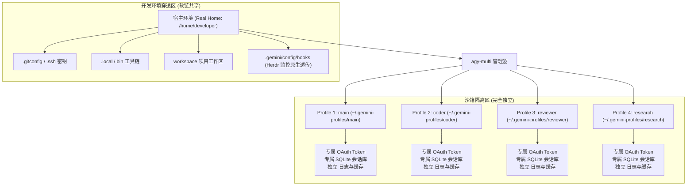
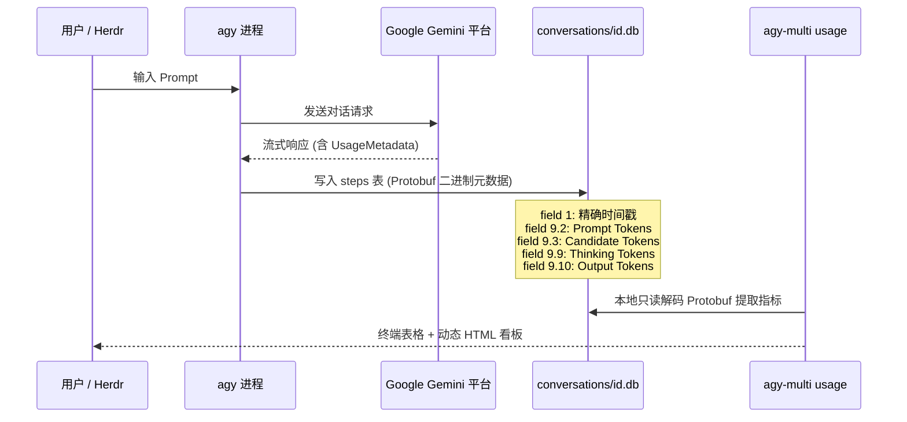

# 产品需求与架构设计文档 (PRD)

**项目名称**：`agy-multi`（兼容别名 `gemini-switch`） — Antigravity (agy) 多账号并发隔离管理与用量监控系统  
**文档版本**：v1.2  
**编写时间**：2026-09-20  
**状态**：已落盘实施 (Implemented)  

---

## 1. 文档概述与产品定位

### 1.1 研发背景
Google Antigravity CLI (`agy`) 是新一代 AI 辅助编程终端工具。在日常高强度编程与多 Agent 协同任务中，开发者面临以下瓶颈：
1. **Google AI Pro 5小时配额限制**：Google 对每个 Pro 账号设有 5 小时滚动窗口的调用上限，高强度编码容易触发限流。
2. **多进程并发写冲突**：`agy` 默认将配置、OAuth Token、会话历史与 SQLite 数据库存放在统一的 `~/.gemini/antigravity-cli/`。在 `herdr` 或 `tmux` 开多个 Pane 并发运行时，多进程同时写入会导致 SQLite 锁冲突、Token 刷新互相覆盖与会话混乱。
3. **开发环境割裂**：若通过切换 Linux 系统用户隔离，会导致 `.gitconfig`、`.ssh` 密钥、开发工具链及工作区配置全部丢失。
4. **配额用量黑盒**：官方缺乏全账号统揽界面，开发者无法直观获知各账号当前 5 小时内已消耗多少 Token、何时释放额度，以及各模型调用的思维链 (Thinking) 与输出 (Output) 细分。

### 1.2 产品定位
`agy-multi` 是专为 `agy` 打造的**轻量级、多账号并发隔离与用量可视化平台**。通过单机多 Profile 沙箱软链穿透，实现多账号真正无锁并发；通过逆向解析底层 SQLite Protobuf 元数据，构建实时 5 小时滚动配额、周度消耗及动态重置倒计时的可视化看板。

### 1.3 适用范围与边界 (Scope & Non-Goals)
1. **仅限 CLI 终端交互环境**：本项目专门为 Antigravity CLI (`agy`) 终端工具定制，**明确不支持**桌面 GUI 应用程序（如 Antigravity 2.0 桌面端或 Antigravity IDE 独立窗口），GUI 应用由系统桌面管理器启动并使用系统级钥匙串，不受终端 `$HOME` 隔离控制。
2. **严禁反向代理与流量劫持**：本项目坚决不采用任何反向代理、中间人拦截或网络层中转机制。所有模型交互与通信均由原生 `agy` 进程直连，确保使用安全与合规。
3. **平台适用性**：以 Linux (Ubuntu/Debian/Fedora) 及 Windows WSL2 为主力支持与验证平台；macOS (CLI) 终端因缺少原生 `/proc` 且 Shell/权限机制有差异，定位于实验性/社区支持；Windows 原生环境目前不支持。

---

## 2. 系统总体架构与隔离设计

### 2.1 隔离架构原理
系统在宿主真实家目录（如 `/home/developer/`）下创建独立的沙箱管理目录 `~/.gemini-profiles/<profile_name>/`：

### 2.2 核心技术机制
1. **独立登录态与存储**：
   每个 Profile 独立持有 `.gemini/antigravity-cli/antigravity-oauth-token` 与 `conversations/*.db`，彻底消除并发写锁冲突与串号问题。
2. **透明环境穿透**：
   通过 `sync_profile_environment` 自动将宿主根目录下的配置文件以软链接形式挂载进各 Profile 目录，保持 Git 身份、SSH 鉴权与环境变量无感知一致。
3. **Herdr 监控原生兼容**：
   主动穿透 `~/.gemini/config/hooks`，在 `herdr` 多 Pane 并发运行时，侧边栏能够精准捕获每个 Pane 中 Agent 的思考、执行与空闲状态。
4. **真实家目录防退化机制 (`AGY_REAL_HOME`)**：
   在子 Profile 会话内部运行时，`$HOME` 被修改为 Profile 目录。系统内置智能回退探测：若检测到当前 `HOME` 位于 `.gemini-profiles/` 路径内，自动向上推导真实宿主目录，确保子环境中运行 `agy-multi` 依然正常识别全局账号列表。
5. **快捷指令矩阵**：
   通过 `agy-multi install` 向 `~/.local/bin` 注册全局快捷脚本：
   - ID 命令：`agy-1`, `agy-2`, `agy-3`, `agy-4`
   - 别名命令：`agy-main`, `agy-coder`, `agy-reviewer`, `agy-research`

---

## 3. 用量监控看板 (Usage Dashboard) 设计

### 3.1 数据逆向工程与采集方案
通过对 `agy` 底层存储机制的深入逆向，定位到模型每次交互均持久化于 `conversations/<conversation_id>.db` 的 `steps` 表中。

- **零网络开销**：纯本地 SQLite 读取与 Protobuf Varint 解码，无需调用任何云端 API，无网络延迟与二次鉴权风险。
- **毫秒级全量聚合**：数百次调用、数百万 Token 的数据提取耗时小于 50ms。

### 3.2 核心业务指标定义
| 维度 | 指标项 | 说明 |
|:---|:---|:---|
| **请求量** | `requests` | 模型交互轮数（Turns），反映调用频度 |
| **输入 Token** | `prompt_tokens` | 上下文、系统指令与用户 Prompt 所占 Token |
| **思维 Token** | `thinking_tokens` | Gemini 思考模型（Reasoning）推导过程 Token |
| **输出 Token** | `output_tokens` | 模型最终生成答复的 Token |
| **总 Token** | `total_tokens` | `prompt_tokens + candidate_tokens`（含思考与输出） |

### 3.3 5 小时滚动配额与重置倒计时算法
Google AI Pro 采用 5 小时滑动窗口（Rolling Window）限制配额。系统针对每个账号实现以下时间窗口计算模型：

1. **窗口时间阈值**：
   $$\text{Threshold}_{5h} = \text{CurrentTime} - 5 \times 3600$$
2. **5小时窗口内使用量**：
   统计所有满足 $\text{Timestamp} \ge \text{Threshold}_{5h}$ 的 Step 记录。
3. **首个请求恢复倒计时 (Next Reset Countdown)**：
   $$\text{NextResetTS} = \min(\text{Timestamps}_{5h}) + 5 \times 3600$$
   $$\text{Countdown}_{\text{next}} = \max(0, \text{NextResetTS} - \text{CurrentTime})$$
   *业务意义*：距离 5 小时前最早一笔请求释放、开始恢复额度的精确剩余时间。
4. **完全重置倒计时 (Full Reset Countdown)**：
   $$\text{FullResetTS} = \max(\text{Timestamps}_{5h}) + 5 \times 3600$$
   $$\text{Countdown}_{\text{full}} = \max(0, \text{FullResetTS} - \text{CurrentTime})$$
   *业务意义*：若不再发起新请求，账号配额完全恢复为 100% 满额的时间。
5. **满额就绪状态**：
   若 $\text{requests}_{5h} = 0$，状态直接标记为 `100% 额度就绪`。

### 3.4 7 天周度趋势模型
- 以当前自然天为基准，统计近 7 天每日的请求数与 Token 消耗。
- 动态计算周内每日最高消耗量作为比例标尺，渲染迷你柱状图（Sparkline）。

### 3.5 看板界面 (UI/UX) 规范
- **视觉风格**：深色模式科技风（Dark Theme + Glassmorphism 玻璃拟态卡片 + 霓虹发光徽章）。
- **顶栏全局态**：监控账号总数、有效登录数、活跃进程数、近 5 小时全账号总 Token、近 7 天总 Token。
- **账号卡片**：
  - 账号基本信息（ID、别名、邮箱、状态、PID）。
  - **5 小时窗口**：进度条、Token 细分 Chips、**动态秒级重置倒计时组件**。
  - **7 天走势**：每日柱状图（带 Hover 提示：日期、Token 数、请求数）。
- **会话穿透列表**：支持按账号 Tab 过滤，按时间倒序展示具体会话标题、ID、请求数、Prompt / Thinking / Output Token。
- **动态交互**：
  - 客户端原生 JavaScript 秒级倒计时驱动器（`setInterval`），页面无需刷新即可实时读秒。
  - 一键刷新数据。
  - 一键导出结构化 JSON 数据。

---

## 4. 命令行接口 (CLI) 规范

| 命令 | 参数 | 描述 |
|:---|:---|:---|
| `agy-multi list` (或 `ls`) | 无 | 查看所有 Profile 状态、认证邮箱、活跃 PID |
| `agy-multi usage` (或 `stats`) | `--html [path]`, `--json` | 打印终端统计概览，并自动更新/生成 HTML 看板 |
| `agy-multi serve` | `--port [P]`, `--host [H]` | 启动实时 Web 监控看板服务（默认 127.0.0.1:8989） |
| `agy-multi run` | `<ID\|Name> [agy_args...]` | 在指定 Profile 沙箱中启动 `agy`（支持透传任意原生参数） |
| `agy-multi login` | `<ID\|Name>` | 触发指定 Profile 的一次性 Google OAuth 浏览器认证 |
| `agy-multi add` | `<name> <email> [-d desc] [--id ID]` | 注册新 Profile 并初始化沙箱软链 |
| `agy-multi edit` | `<ID\|Name> [--name N] [--email E]` | 修改 Profile 别名、邮箱或描述 |
| `agy-multi install` | 无 | 生成并同步全局 `agy-N` 快捷命令到 `~/.local/bin` |

---

## 5. 示例配置账号与状态矩阵

| ID | 快捷指令 | 账号别名 | 示例邮箱 | 认证状态 | 5H 状态 | 说明 |
|:---|:---|:---|:---|:---|:---|:---|
| **1** | `agy-1` / `agy-main` | `main` | `main@example.com` | ● Logged In | Ready (100%) | 主开发账号 |
| **2** | `agy-2` / `agy-coder` | `coder` | `coder@example.com` | ● Logged In | Ready (100%) | 辅助开发账号 |
| **3** | `agy-3` / `agy-reviewer` | `reviewer` | `reviewer@example.com` | ● Logged In | 动态倒计时 | 测试审查账号 |
| **4** | `agy-4` / `agy-research` | `research` | `research@example.com` | ○ Not Auth | Ready (100%) | 备用研究账号（待认证） |

---

## 6. 质量保证与测试体系

### 6.1 自动化测试矩阵 (`pytest`)
- **`test_jwt_payload_decode`**：验证 OAuth `id_token` JWT Base64 解码与邮箱提取逻辑。
- **`test_profile_manager_lifecycle`**：测试沙箱目录创建、软链同步、增删改查全生命周期。
- **`test_detect_real_home`**：测试环境变量 `AGY_REAL_HOME` 及在 `.gemini-profiles/` 子目录下的真实路径推导。
- **`test_decode_varint`**：验证 Protobuf Varint 变长字节解码正确性。
- **`test_parse_step_metadata_empty`**：测试元数据解析边界与空值安全。
- **`test_render_html_dashboard`**：验证单页 HTML 看板渲染与结构完整性。

---

## 7. 未来演进规划 (Roadmap)

1. **智能路由分流 (Smart Router)**：
   在 CLI 运行层增加代理调度模式 `agy-auto`，当检测到当前账号 5 小时配额接近饱和或触发 429 时，自动无感切换至下一个就绪账号。
2. **常驻后台监控守护 (Daemon & Webhooks)**：
   提供轻量级 background service，当某个账号完成 5 小时配额重置恢复时，发送桌面通知或钉钉/飞书 Webhook 告警。
3. **Web 服务模式**：
   支持 `agy-multi serve --port 8989`，提供带 RESTful API 的轻量常驻 Web 服务。
