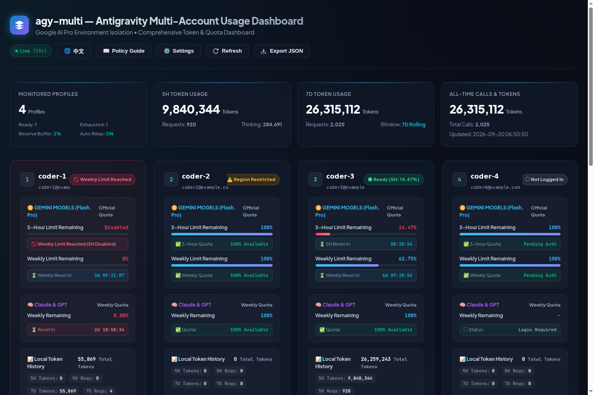

# agy-multi

> Never lose a session to the 5-hour quota wall again.

Concurrent multi-account isolation & real-time usage dashboard for Google Antigravity CLI (`agy`).

[](LICENSE)
[](https://python.org)
[](https://github.com/awu5425/agy-multi)
[](https://github.com/awu5425/agy-multi)

[English](README.md) | [简体中文](README_zh.md)

---



> 🎬 **Demo**: *`agy-auto` handing a live session to the next account the second quota hits zero — 30s GIF coming soon.*

---

## The problem

You're 40 minutes into a deep refactor. Gemini slams into the 5-hour rolling quota. Your options: stare at a countdown, or start a fresh session and re-explain everything.

**agy-multi gives you a third option.** Run your `agy` sessions in isolated per-account sandboxes. The moment one account's quota runs dry, a watchdog gracefully hands your live session — conversation, context, everything — to your next account. Same terminal window. Zero context lost.

---

## What you get

- 🔄 **Quota watchdog + auto-relay** — monitors the official 5-hour rolling quota in the background; on exhaustion it SIGINT-saves, backs up SQLite via the Online Backup API, and relaunches on the idlest account in the exact same terminal.
- 📊 **Real-time usage dashboard** — 5h/weekly quota bars with second-precision countdowns, token trends with Read / Write / Cache / Thinking breakdowns, GitHub-style activity calendar, one-click EN/中文.
- 🔒 **True per-account sandboxing** — isolated OAuth tokens, conversation logs and SQLite DB per profile (`USERPROFILE` and `HOME` redirection); concurrent terminals never fight over locks. Sensitive dirs (`.ssh`, `.gnupg`, `.aws`, `.azure`, `.kube`, `.docker`) excluded by default.
- 🪟 **Native Windows, Windows Terminal & Orca Client Deep Integration** — unprivileged NTFS directory junctions (`_winapi.CreateJunction`), Win32 process tracking, cross-platform Sentinel file IPC, split-pane & new-tab launcher (`agy-multi split` / `wt`), automatic pane & tab title naming (`agy-multi use` / `title`), and `.cmd` wrapper scripts.
- 🖥️ **Any terminal, any multiplexer** — Orca Client, Windows Terminal, Herdr, Tmux, PowerShell, CMD, VS Code integrated terminal…

*Independent community project — not affiliated with Google. See [Disclaimer](#disclaimer--terms-of-service).*

---

## Quick Start (2 minutes)

### 1. Install & initialize

**Linux / macOS:**
```bash
git clone https://github.com/awu5425/agy-multi.git
cd agy-multi
./install.sh && agy-multi init
```

**Windows (PowerShell / Command Prompt / Windows Terminal / Orca):**
```powershell
git clone https://github.com/awu5425/agy-multi.git
cd agy-multi
pip install -e .
agy-multi init
```

The wizard imports your existing Antigravity login as Profile 1 (main), walks you through adding secondary accounts, and registers global shortcuts (`agy-1`, `agy-2`, `agy-auto` on Linux/macOS, plus native `.cmd` wrappers on Windows) in `~/.local/bin`.

### 2. Launch with auto-watchdog

```bash
agy-auto                                            # recommended: auto-picks the best idle account, relays on quota exhaustion
agy-1                                               # a specific profile
agy-coder -p "Review unresolved TODOs in this repo"  # any native agy args pass through
```

**Windows Terminal / Orca Client split-pane / tab launching:**
```powershell
agy-multi split coder --split v    # launch in a vertical split pane (auto-detects Orca or Windows Terminal)
agy-multi split coder --split h    # launch in a horizontal split pane
agy-multi split coder --tab        # launch in a new tab
agy-multi use                      # rename current pane/tab to active profile (Orca/Herdr/Tmux/ANSI)
```

### 3. Watch your quotas

```bash
agy-multi status    # quota, watchdog policy, next relay candidate
agy-multi serve     # local web dashboard → http://127.0.0.1:8989
```

### 4. 24/7 Background token refresh & credential keeper (`agy-multi creds`)

Google OAuth access tokens expire every 60 minutes. When secondary accounts sit idle, expired tokens cause the dashboard to report "Credential expired". `agy-multi` provides an open-source, zero-configuration solution:

```bash
agy-multi creds           # inspect current OAuth credentials status or test auto-discovery
agy-multi creds --save    # auto-extract official credentials from local agy binary and save to ~/.config/agy-multi/env & ~/.bashrc
```

- **Zero GCP setup required**: Automatically reuses official client credentials embedded in your installed Antigravity binary.
- **Strictly open-source safe**: Zero hardcoded secrets in the git repository; all discovery and config happens locally on the user's host with `0600` permissions.
- **Universal automatic loading**: CLI commands, runner scripts (`agy-auto`, `agy-1`, etc.), Web dashboard, and systemd services automatically source `~/.config/agy-multi/env` for seamless background token refreshes.

---

## How the relay works

1. **Launch & readiness** — `agy-auto` scores every idle profile by available quota and starts on the best one.
2. **Runtime watchdog** — background monitor polls the official quota API; when remaining quota ≤ your reserve buffer (default 0%, recommended 5%), handover triggers.
3. **Graceful save** — the session is gracefully interrupted, then SQLite is backed up page-by-page via the official Online Backup API. No WAL corruption, no naive file copies.
4. **Smart target selection** — only profiles with zero active PIDs are eligible; an account busy in another terminal is never picked.
5. **Seamless relaunch** — conversation DB, metadata and Brain artifacts transfer over; the new session starts in the exact same terminal window.
6. **Safe exit** — while waiting out a cooldown, the supervisor exits cleanly (code 0) if the session was taken over elsewhere. No split-brain.

> Every relay takes an exclusive cross-platform file lock (`relay.lock` via `msvcrt.locking` on Windows and `fcntl.flock` on POSIX), so even simultaneous triggers can't race each other.

---

## Dashboard

```bash
agy-multi serve                                        # localhost only (default 127.0.0.1:8989)
agy-multi serve --port 8989
agy-multi serve --host 0.0.0.0 --port 8989 --token YOUR_SECURE_TOKEN  # LAN / network
```

- **Quota at a glance (official order alignment)** — strictly adheres to official Google Antigravity order: **5-Hour rolling quota first**, followed by **Weekly quota second** with second-precision reset countdowns; 🧠 Claude & GPT weekly bars with exhaustion alerts.
- **High-density compact layout** — reset countdown pill (`.quota-cd-pill`) is cleanly merged inside the quota meter container (`.quota-meter`), eliminating redundant vertical height.
- **Low quota warning indicator** — accounts with weekly quota < 20% display a noticeable yellow warning badge (`LOW_WEEKLY`), providing early warning while remaining eligible for relay fallback.
- **Token analytics** — trend curves with Total / Read·Write·Cache / Thinking·Output views, linear↔log scale, GitHub-style daily calendar with hover breakdowns (Prompt / Thinking / Output / requests).
- **One-click relay** — hit 🚀 Relay on any session card to move it immediately.
- **Settings modal** — reserve-buffer slider (0–50%, 0.5% steps), auto-takeover toggle, instant persistence.
- **Relay lifecycle diagram** — full-screen flowchart of the 5-phase handover.
- **Terminal fallback** — `agy-multi usage`, plus `--csv`, `--html`, `--json` static exports.

> 🔐 **Security**: localhost-only by default; on any non-loopback bind every endpoint (including GET) requires auth — an admin token is auto-generated and printed if you forget `--token`. OAuth token files are `0600`, directories `0700`.

---

<details>
<summary><b>🧩 Multi-terminal workflow example</b></summary>

Open sessions in any setup — regular tabs, IDE split terminals, tmux / zellij, Windows Terminal:
- **Terminal 1** — `agy-1`: core coding & refactoring
- **Terminal 2** — `agy-2`: concurrent test runs and code review
- **Terminal 3** — `agy-3`: deep research and system design

Each session draws from its own Pro quota and its own SQLite database — no lock contention, no cross-account rate-limit pileups.

</details>

<details>
<summary><b>⌨️ Full command reference</b></summary>

```bash
agy-multi list | ls                  # profiles, auth status, active PIDs
agy-multi login 1                     # one-time Google OAuth flow (token stored in the profile sandbox)
agy-multi add coder coder@ex.com -d "Refactoring lead"
agy-multi edit 2 --name coder-pro --email newcoder@ex.com
agy-multi run [profile]               # same as agy-auto
agy-multi tab [profile] [-p DIR]       # launch inside a new Orca or Windows Terminal tab (worktree-aware)
agy-multi split [profile] [--split v|h] # launch inside Orca or Windows Terminal split pane
agy-multi use [profile]               # rename current terminal pane & tab to profile (alias title/switch)
agy-multi relay                       # smart auto-relay of the active session
agy-multi relay --to 2                # targeted relay
agy-multi relay <cid> --from 1 --to 2 # explicit conversation transfer
agy-multi relay --no-exec             # sync session & brain data without launching agy
agy-multi relay --list-candidates     # quota scores, 5H status, idle state of targets
agy-multi config                      # view config
agy-multi config --min-buffer 5       # reserve buffer % (0–50); accounts at/below it trigger handover
agy-multi config --on-no-target pause # pause (default: exact countdown, auto-wake) | burn_buffer (spend to 429)
agy-multi creds [--save]          # inspect or auto-discover & save OAuth credentials for 24/7 background refresh
agy-multi usage [--csv] [--html PATH] [--json]
```

</details>

<details>
<summary><b>🖥️ Platform support</b></summary>

| Capability | Linux (primary) | Windows native | macOS (CLI) | Desktop GUI apps |
| :--- | :---: | :---: | :---: | :---: |
| Profile & token sandboxing | ✅ Full | ✅ Full (USERPROFILE & NTFS Junctions) | ⚠️ Basic | ❌ |
| Process & PID tracking | ✅ Native (/proc) | ✅ Native (Win32 OpenProcess) | ⚠️ Basic (ps/pgrep, TCC limits) | — |
| 5H quota watchdog & relay | ✅ Full | ✅ Full (Sentinel file IPC) | ⚠️ Basic | ❌ |
| Orca Client pane split & auto-rename | ✅ Full | ✅ Full (`orca terminal rename / split`) | ✅ Full | — |
| Windows Terminal split-pane | — | ✅ Full (`agy-multi wt / split`) | — | — |
| Web dashboard | ✅ Full | ✅ Full | ✅ Full | ⚠️ CLI logs only |
| Background daemon | ✅ systemd | ⚠️ Task Scheduler / NSSM | ⚠️ Manual launchd | ❌ |

> Windows native and Orca client environments are fully supported with zero external dependencies (utilizing unprivileged NTFS junctions, Win32 API, Sentinel IPC, and Orca / Windows Terminal integration). macOS CLI support is experimental. Desktop GUI apps (Antigravity 2.0 / IDE) are out of scope — they keep secrets in OS keychains and can't be sandboxed via `$HOME`.

</details>

---

## FAQ

### Is this against Google's Terms of Service?
`agy-multi` is an independent tool that talks to Google's official APIs directly — strictly no reverse proxy, no MITM, no traffic interception. It's built for developers managing their own legitimate accounts (personal, workspace, client). You are responsible for complying with Google's ToS; the project does not encourage quota abuse or unauthorized multi-accounting.

### Why not just log out and log back in as another account?
Because you'd lose workspace state and conversation context — and two concurrent sessions on one profile collide on SQLite locks. `agy-multi` gives each account its own sandbox and moves the live conversation over.

### Does it work on macOS / Windows?
- **Windows native**: Fully supported out of the box (PowerShell, Command Prompt, and Windows Terminal split-panes).
- **macOS terminal**: Experimental community support.

### What about the Antigravity desktop app / IDE?
Not supported, CLI only — GUI apps store secrets in OS keychains and can't be controlled via terminal `$HOME` sandboxing or process signals.

### What if every account is out of quota?
The fallback policy decides: `pause` (default) prints the exact countdown to the earliest reset and auto-wakes; `burn_buffer` spends the reserve down to the 429.

---

## Roadmap

- [ ] Automated relay for Claude / GPT multi-day quotas (tracking already live on the dashboard)
- [ ] Community-tested macOS support
- [ ] Your idea here — issues and PRs welcome

---

## Disclaimer & Terms of Service

### Legal & Compliance Notice

1. **Independent Project**: `agy-multi` is an independent, community-driven open-source developer tool. It is not affiliated with, authorized, maintained, sponsored, or endorsed by Google LLC, Alphabet Inc., or any of their subsidiaries. All Google trademarks, service marks, and logos are property of Google LLC.
2. **Legitimate Developer Use**: This tool is designed strictly for individual developers or authorized engineering teams managing their own multiple legitimate Google accounts (such as personal, corporate workspace, and client project accounts) within their local development environments.
3. **Terms of Service Compliance**: Users are solely responsible for ensuring that their usage of multiple Google accounts complies with Google's Terms of Service, Generative AI Additional Terms of Service, and applicable Acceptable Use Policies. The project maintainers do not encourage or condone quota abuse, rate limit circumvention, or unauthorized multi-accounting.
4. **Limitation of Liability**: This software is provided "as is", without warranty of any kind. Under no circumstances shall the authors or copyright holders be liable for any claims, damages, account suspensions, or service disruptions arising from the use of this software.

---

## License

This project is licensed under the [MIT License](LICENSE).
